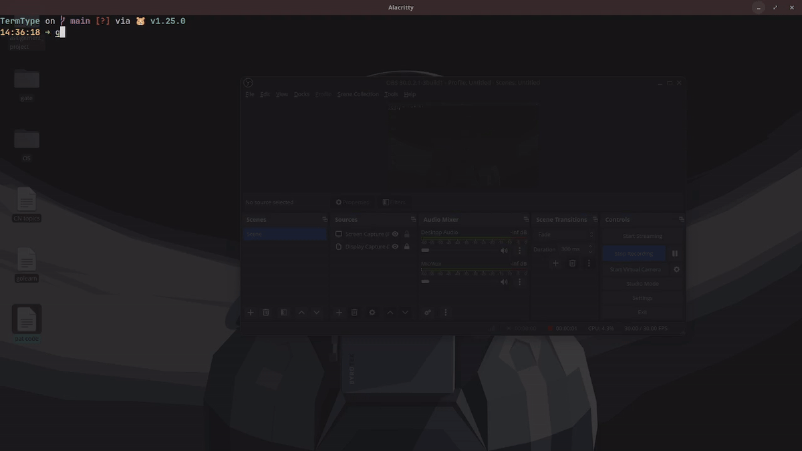
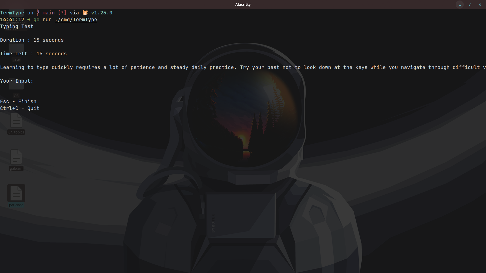
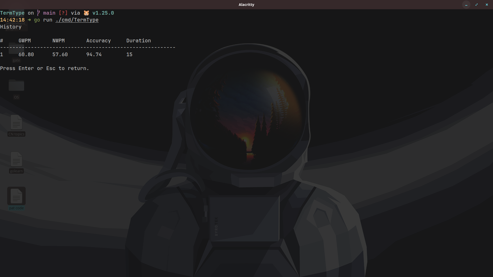

# TermType

A terminal-based typing speed test application built with Go and the Bubble Tea TUI framework. TermType measures your typing performance in the terminal with real-time feedback, persistent session history, and per-duration statistics.

---

## Features

- Timed typing tests with durations of 15, 30, 60, and 120 seconds
- Real-time character-by-character input tracking
- Gross WPM (GWPM), Net WPM (NWPM), and accuracy calculation
- Persistent session storage using a local SQLite database
- Session history log with tabular display
- Per-duration average and maximum statistics
- Keyboard-driven navigation with Vim-style keybindings

---

## Requirements

- Go 1.25 or later
- A terminal emulator with UTF-8 support

---

## Installation

Clone the repository and build the binary:

```bash
git clone https://github.com/Adarshrai24/TermType.git
cd TermType
go build -o TermType ./cmd/TermType
```

Run the application from the project root directory:

```bash
./TermType
```

> **Note:** The application must be run from the project root directory. It reads passage data from `internal/data/english.txt` and writes session data to `TermType.db`, both resolved relative to the working directory.

---

## Preview
<p align="center">
  
  &nbsp;
  
  &nbsp;
  
</p>

## Usage

### Navigation

| Key            | Action                        |
|----------------|-------------------------------|
| `Up` / `k`     | Move cursor up                |
| `Down` / `j`   | Move cursor down              |
| `Enter`        | Confirm selection             |
| `Esc`          | Go back / finish current test |
| `q` / `Ctrl+C` | Quit the application          |

### Workflow

1. Launch the application. The main menu presents three options: **Start Test**, **History**, and **Statistics**.
2. Select **Start Test** and choose a duration (15, 30, 60, or 120 seconds).
3. Begin typing. The timer starts on the first keypress.
4. The test ends automatically when the time runs out or when the passage is completed. Press `Esc` to end a test early.
5. Results are displayed immediately after the test and are saved automatically to the local database.
6. Return to the main menu to view **History** (a chronological list of all past sessions) or **Statistics** (average and maximum scores grouped by duration).

---

## Metrics

| Metric   | Formula                                              |
|----------|------------------------------------------------------|
| GWPM     | `(totalChars / duration) * 12`                       |
| NWPM     | `((totalChars - mistakes) / duration) * 12`          |
| Accuracy | `((totalChars - mistakes) / totalChars) * 100`       |

A "word" is defined as 5 characters, which is the standard WPM convention. The factor of 12 converts characters-per-second into words-per-minute using a 60-second minute and a 5-character word length.

---

## Architecture

The project follows a layered package structure with a clear separation of concerns.

```
TermType/
├── cmd/
│   └── TermType/
│       └── main.go          # Application entry point
├── internal/
│   ├── app/
│   │   └── app.go           # Root Bubble Tea model and screen router
│   ├── screens/
│   │   ├── menu.go          # Main menu screen
│   │   ├── time.go          # Duration selection screen
│   │   ├── test.go          # Active typing test screen
│   │   ├── result.go        # Post-test result screen
│   │   ├── history.go       # Session history screen
│   │   └── stats.go         # Aggregate statistics screen
│   ├── test/
│   │   └── test.go          # WPM and accuracy calculation logic
│   ├── data/
│   │   ├── pick.go          # Passage selection logic
│   │   └── english.txt      # Passage corpus
│   └── storage/
│       ├── db.go            # SQLite connection and schema initialisation
│       ├── sessions.go      # Session persistence and history retrieval
│       └── stats.go         # Aggregate query functions (AVG, MAX)
└── TermType.db                # SQLite database file (created on first run)
```

### Package Responsibilities

**`cmd/TermType`**  
The entry point. Creates a new Bubble Tea program with the root `app.Model` and runs it.

**`internal/app`**  
The root model. Owns the SQLite database connection and the current screen state. Implements the Bubble Tea `Model` interface (`Init`, `Update`, `View`) and routes messages to the appropriate screen model based on the active screen. Manages transitions between screens by inspecting boolean flags set by child models.

**`internal/screens`**  
Contains one model per screen, each implementing Bubble Tea's `Update` and `View` pattern:
- `MenuModel`: Renders the main menu and signals the parent when a selection is made.
- `TimeModel`: Presents the duration options and signals which duration was chosen.
- `TestModel`: Manages the active typing session including the countdown timer, character comparison, and mistake counting.
- `ResultModel`: Displays the WPM and accuracy results for the completed session.
- `HistoryModel`: Loads and renders the full session history from the database.
- `StatsModel`: Loads and renders average and maximum statistics for each duration bracket.

**`internal/test`**  
Pure calculation logic. The `Calculate` function accepts total characters typed, mistake count, and duration, and returns a `Result` struct containing GWPM, NWPM, and accuracy. This package has no dependencies on I/O, storage, or the TUI framework.

**`internal/data`**  
Handles passage selection. `RandomParagraphPick` reads the `english.txt` corpus, splits it on `===` delimiters, and returns a randomly selected passage.

**`internal/storage`**  
Manages all database interaction:
- `db.go`: Opens the SQLite connection and creates the `sessions` table if it does not exist.
- `sessions.go`: Inserts new session records and retrieves the full history in reverse chronological order.
- `stats.go`: Queries aggregate `AVG` and `MAX` statistics filtered by duration.

### Data Flow

```
User Input
    |
    v
app.Model.Update()
    |
    +-- Routes to active screen model (e.g. TestModel)
    |
    v
Screen model processes input, updates internal state
    |
    +-- On test completion: test.Calculate() computes result
    |
    +-- storage.SaveSession() persists result to SQLite
    |
    +-- Sets Finished = true; app.Model transitions to ResultScreen
    |
    v
app.Model.View() delegates to active screen's View()
    |
    v
Terminal output via Bubble Tea renderer
```

---

## Database Schema

Session data is stored in a local SQLite file (`TermType.db`) created automatically on first run.

```sql
CREATE TABLE IF NOT EXISTS sessions (
    id         INTEGER PRIMARY KEY AUTOINCREMENT,
    gwpm       REAL    NOT NULL,
    nwpm       REAL    NOT NULL,
    accuracy   REAL    NOT NULL,
    duration   INTEGER NOT NULL,
    created_at DATETIME DEFAULT CURRENT_TIMESTAMP
);
```

---

## Dependencies

| Dependency                          | Purpose                                      |
|-------------------------------------|----------------------------------------------|
| `charm.land/bubbletea/v2`           | Terminal UI framework (Elm-architecture TUI) |
| `modernc.org/sqlite`                | Pure-Go SQLite driver (no CGo required)      |
| `github.com/charmbracelet/x/ansi`   | ANSI terminal escape sequence handling       |
| `github.com/charmbracelet/x/term`   | Terminal capability detection                |

All dependencies are managed via Go modules (`go.mod` / `go.sum`).

---


